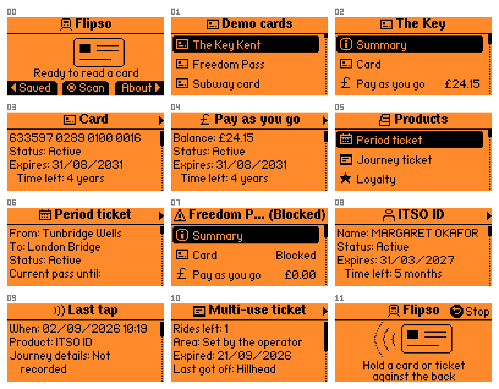

# Flipso

**Read UK ITSO public transport smartcards with a Flipper Zero.**

Tap your bus pass or rail smartcard on the back of your Flipper and see the
tickets, passes, entitlements, journeys and pay-as-you-go balance stored on it.

  
  
  

## What is Flipso?

**ITSO** is the UK's national standard for interoperable public transport
ticketing. If you've got an ENCTS or Freedom Pass, a season ticket on a bus or
rail smartcard, or a local authority travel card, it's probably an ITSO card.

Flipso reads ITSO cards over the Flipper's NFC reader, then decodes it and
shows you everything that was on it.

## What it shows you

ITSO cards contain a surprising amount of data in 4 KB of chip storage, all
laid out by the ITSO TS 1000 specification. Flipso decodes as much of it
as it can:

- **Tickets** — journey, period and carnet products, with operator, validity and the stations they cover
- **Pay as you go** — balance, owning operator and purse, and the most recent transactions
- **Cardholder** — name, date of birth, concession and entitlements
- **Journeys** — recent taps and completed journeys, with origin, destination, and fare
- **Paper tickets** — ITSO's compact paper tickets, like Glasgow Subway paper NFC singles, returns and day tickets:
  rides left, price, when and at which station they were last used
- **NFC tag tickets** — ITSO cards on NTAG215/216 and MIFARE Ultralight EV1 tags (CMD9 and CMD10), read like a
  smartcard, with the chip's lock bits and, on an NTAG, how many uses it has left

Station and operator names are resolved on the device from bundled reference
data.

  

## Getting started

### Requirements

- A **Flipper Zero**
- [**ufbt**](https://github.com/flipperdevices/flipperzero-ufbt)
- A UK ITSO smartcard

Flipso works on both official Flipper Zero and Momentum firmwares.

### Build and install

Build and deploy Flipso to your Flipper Zero by running `ufbt launch`.

### Bus stop names

Copy `data/naptan.dat` to `apps_data/flipso/naptan.dat` on the SD card if you
want Flipso to decode bus stop NaPTANs. There are over 300k bus stops in the
UK (21 MB), so this data set is shipped alongside the app rather than bundled
into it.

## Contributing

Contributions are welcome — particularly **operator names and card branding**
and **fixes for cards that do not read**.

Whilst Flipso has been developed and tested against real cards, some media
types and IPEs are rather uncommon and I haven't seen them in the wild.

Some of these have been implemented speculatively based on the ITSO 
specification. As such some of the more unusual products are untested 
against real media.

### Claude Code

Flipso is tooled out for AI-first development with Claude Code. When making
changes, please keep the skills and tooling up to date.

Claude's tooling includes `flipctl` - a little python util that encapsulates
most of the problem solving required to develop/debug on a physical Flipper
Zero device connected via USB. This drastically reduces fault-finding cycles
and helps keep token usage down.

Claude has been carefully housetrained to develop responsibly according to
my guidance and desire for unit tests. A good starting point is to scan your
card for Claude. If you're building a large new feature Claude will benefit
from synthesizing cards so he can test them on the device without needing
you around to tap them.

## Licensing

Flipso is free software released under the [GNU General Public License v3.0](LICENSE).

### NLC codes

Railway NLC codes kindly provided by
[railwaycodes.org.uk](https://www.railwaycodes.org.uk). A small donation has
been made to [Swindon Food Collective](https://www.swindonfoodcollective.org)
in exchange for the use of this dataset.

### Bus stop NaPTANs

Bus stop NaPTANs published by the [Department for Transport](https://beta-naptan.dft.gov.uk) under
the Open Government Licence.

### ITSO specification

Field offsets are taken from ITSO TS 1000 version 2.1.5 (March 2025), published
by ITSO Ltd under the Open Government Licence. Each part is available to download
from the [ITSO technical specification](https://www.itso.org.uk/itso-specification/itso-technical-specification)
site. Flipso is written against:

| Part                                                                      | Title                                               | Contents                                                                 |
|---------------------------------------------------------------------------|-----------------------------------------------------|--------------------------------------------------------------------------|
| [TS 1000-0](https://www.itso.org.uk/hubfs/TS_1000-0_V2_1_5_2025_03.pdf)   | Concept and Context                                 | An overview of the scheme                                                |
| [TS 1000-1](https://www.itso.org.uk/hubfs/TS_1000-1_V2_1_5_2025_03.pdf)   | General Reference                                   | Data types: dates, timestamps, values, locations                         |
| [TS 1000-2](https://www.itso.org.uk/hubfs/TS_1000-2_V2_1_5_2025_03.pdf)   | Customer Media Format and Data Record Definitions   | The shell, directory, product (IPE) and value record layouts             |
| [TS 1000-5](https://www.itso.org.uk/hubfs/TS_1000-5_V2_1_5_2025_03.pdf)   | Customer Media Data and Customer Media Architecture | The fields of each product type, and the journey log                     |
| [TS 1000-7](https://www.itso.org.uk/hubfs/TS_1000-7_V2_1_5_2025_03.pdf)   | ITSO Security Subsystem                             | Cryptography Flipso can't do without an ISAM                             |
| [TS 1000-10](https://www.itso.org.uk/hubfs/TS_1000-10_V2_1_5_2025_03.pdf) | Customer Media Definitions                          | Where the data sits on each kind of card (CMD2, CMD4, CMD7, CMD9, CMD10) |

See [`docs/PROTOCOL.md`](docs/PROTOCOL.md) for further information on Flipso's implementation.
