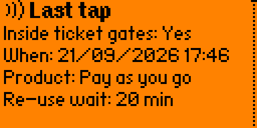
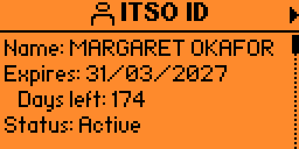

<div align="center">

# Flipso

**Read UK ITSO public transport smartcards with a Flipper Zero.**

Tap your bus pass or rail smartcard on the back of your Flipper and see the
tickets, passes, entitlements, journeys and pay-as-you-go balance stored on it.


<p>
  
  
  
</p>

</div>

## What is Flipso?

**ITSO** is the UK's national standard for interoperable public transport
ticketing. If you carry an ENCTS or Freedom Pass, a season ticket on a bus or
rail smartcard, or a local authority travel card, it is almost certainly an
ITSO card.

Flipso reads that card over NFC and decodes what is on it — no account, no app,
no operator to log in to. Everything it shows comes straight off the card in
your hand.

## What it shows you

An ITSO card packs a surprising amount into its 4 KB, all laid out by the ITSO
TS 1000 specification. Flipso decodes as much of it as it can:

* **Tickets** — journey, period and carnet products, with operator, validity and the stations they cover
* **Pay as you go** — balance, owning operator and purse, and the most recent transactions
* **Cardholder** — name, date of birth, concession and entitlements
* **Journeys** — recent taps and completed journeys, with origin, destination, fare and whether you were inside the gates
* **Paper tickets** — ITSO's compact paper tickets, such as the Glasgow Subway's singles, returns and day tickets: rides left, price, when and at which station they were last used
* **NFC tag tickets** — ITSO cards on NTAG215/216 and MIFARE Ultralight EV1 tags (CMD9 and CMD10), read like a smartcard, with the chip's lock bits and, on an NTAG, how many uses it has left

Station and operator names are resolved on the device from bundled reference
data, so a card that stores nothing but a code still shows a place you
recognise.

|  |  |
| :---: | :---: |
| **Card**<br><sub>The 18-digit ISRN, its issuer and expiry, validated on the device</sub> | **ID &amp; entitlement**<br><sub>Holder identity, concession and entitlement, validity and companion rules</sub> |
|  |  |
| **Products**<br><sub>Every ticket on the card - the purse and ID have rows of their own - each with an icon for its type and a flag for expired, blocked or unused</sub> | **Product detail**<br><sub>Operator, status, validity window, remaining passes and the stations a ticket covers</sub> |

## Getting started

### Requirements

- A **Flipper Zero**
- [**ufbt**](https://github.com/flipperdevices/flipperzero-ufbt)
- A UK ITSO smartcard

### Build and install

```bash
ufbt
ufbt launch
```

### Bus stop names

Copy `data/naptan.dat` to `apps_data/flipso/naptan.dat` on the SD card if you
want Flipso to decode bus-stop NaPTANs. There are nearly half a million bus
stops in the UK (21 MB), so this data set is shipped alongside the app rather
than bundled into it.

## Contributing

Contributions are welcome — particularly **other media types**, **operator
names and card branding**, **station codes**, and **fixes for cards that do not
read**.

### Claude Code

Flipso is tooled out for AI-first development with Claude Code. When making
changes, please keep the skills and tooling up to date.

Claude's tooling includes `flipctl` - a little python util that encapsulates
most of the problem solving required to develop/debug on a physical Flipper
Zero device connected via USB. This drastically reduces fault-finding cycles
and helps keep token usage down.

Claude has been carefully housetrained to develop responsibly according to
my guidance and desire for unit tests. A good starting point is to scan your
card for Claude. If you're building a large new feature Claude will benefit
from synthesizing cards so he can test them on the device without needing 
you around to tap them.

## Licensing

### NLC codes

Railway NLC codes kindly provided by
[railwaycodes.org.uk](https://www.railwaycodes.org.uk). A small donation has
been made to [Swindon Food Collective](https://www.swindonfoodcollective.org)
in exchange for the use of this dataset.

### ITSO specification

Field offsets are taken from ITSO TS 1000 version 2.1.5 (March 2025), published
by ITSO Ltd under the Open Government Licence. Every part is a free download
from the [ITSO technical specification](https://www.itso.org.uk/itso-specification/itso-technical-specification)
page; these are the ones Flipso is written against:

| Part | Title | What Flipso takes from it |
| --- | --- | --- |
| [TS 1000-0](https://www.itso.org.uk/hubfs/TS_1000-0_V2_1_5_2025_03.pdf) | Concept and Context | An overview of the scheme; the place to start |
| [TS 1000-1](https://www.itso.org.uk/hubfs/TS_1000-1_V2_1_5_2025_03.pdf) | General Reference | Data types: dates, timestamps, values, locations |
| [TS 1000-2](https://www.itso.org.uk/hubfs/TS_1000-2_V2_1_5_2025_03.pdf) | Customer Media Format and Data Record Definitions | The shell, directory, product (IPE) and value record layouts |
| [TS 1000-5](https://www.itso.org.uk/hubfs/TS_1000-5_V2_1_5_2025_03.pdf) | Customer Media Data and Customer Media Architecture | The fields of each product type, and the journey log |
| [TS 1000-7](https://www.itso.org.uk/hubfs/TS_1000-7_V2_1_5_2025_03.pdf) | ITSO Security Subsystem | The seals, and why Flipso cannot check them without an ISAM |
| [TS 1000-10](https://www.itso.org.uk/hubfs/TS_1000-10_V2_1_5_2025_03.pdf) | Customer Media Definitions | Where the data sits on each kind of card (CMD2, CMD4, CMD7, CMD9, CMD10) |

[`docs/PROTOCOL.md`](docs/PROTOCOL.md) cites the clause and table behind each
field Flipso decodes.
