<div align="center">

# Flipso

**Read UK ITSO public transport smartcards with a Flipper Zero.**

Tap your bus pass or rail smartcard against the back of a Flipper and see what is
actually stored on it — the card number, the balance, your entitlement, the last
gate you went through, and every ticket loaded onto it.


<table>
  <tr>
    <td>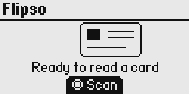</td>
    <td>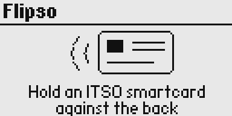</td>
    <td>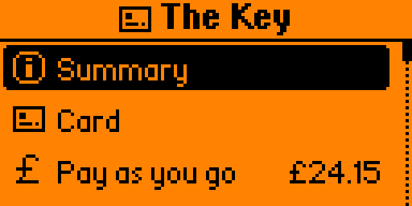</td>
  </tr>
</table>

</div>

## What is Flipso?

**ITSO** is the UK's national standard for interoperable public transport
ticketing. If you have an English concessionary bus pass, a London Freedom Pass,
a season ticket on a rail smartcard, or a local authority travel card, it is
almost certainly an ITSO card. The standard is what lets a card issued by one
operator be accepted by another.

**Flipso is a Flipper Zero app that reads ITSO cards.** Press OK, hold the card against
the back of the Flipper, and it decodes the ITSO Shell and shows you everything
on it. The menu is titled with the card's own branding — Freedom Pass, SPT
Subway — where the operator that issued the shell is one Flipso can name, and
"ITSO Card" where it is not.

### Why this is possible without keys

ITSO protects card data with **cryptographic seals for integrity, not encryption
for confidentiality**. The seals stop you forging a ticket; they do not stop you
reading one. Every data group on an ITSO card is readable without authentication,
so Flipso needs no special keys to work.

## What it shows you

Flipso reads the full ITSO Shell and is implemented to follow the ITSO 
specification.

<table>
  <tr>
    <td align="center" width="33%">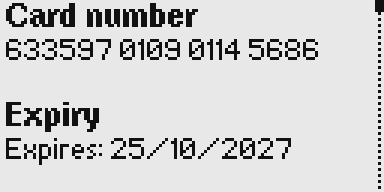<br><b>Card</b><br><sub>18-digit ISRN with check-digit validation, expiry, issuer, media type, shell layout and the shell checksum</sub></td>
    <td align="center" width="33%">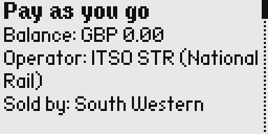<br><b>Pay as you go</b><br><sub>Balance and currency, owning operator, retailer, last transaction and journey in progress</sub></td>
    <td align="center" width="33%">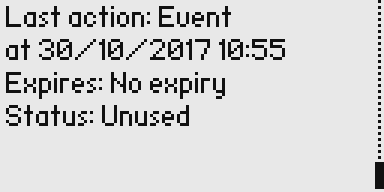<br><b>Purse terms</b><br><sub>Ceiling, overdraft, auto-top-up rule, deposit, and the "No expiry" that a stored zero really means</sub></td>
  </tr>
  <tr>
    <td align="center">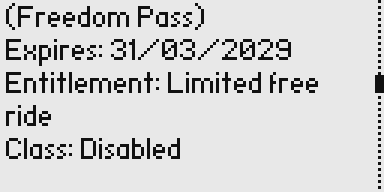<br><b>ID &amp; entitlement</b><br><sub>Holder details, entitlement type, concessionary class, validity dates and area, companion and photo flags</sub></td>
    <td align="center">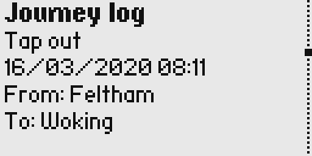<br><b>Last taps</b><br><sub>Tap in/out state and time, the product used, passback, and the journey log with origin, destination and fare</sub></td>
    <td align="center">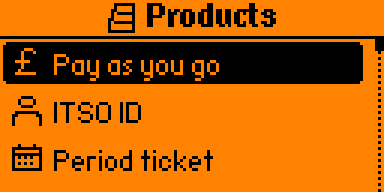<br><b>Products</b><br><sub>Every product in the directory, flagged expired / blocked / unused, each with an icon from its ITSO type</sub></td>
  </tr>
  <tr>
    <td align="center">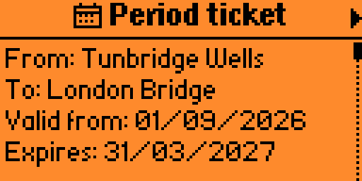<br><b>Product detail</b><br><sub>Operator, validity window, from/to stations, counters, and the instance identity of that one ticket</sub></td>
    <td align="center">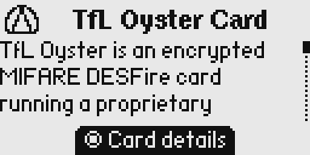<br><b>Oyster recognition</b><br><sub>Not an ITSO card. Flipso says so and explains why, rather than reporting an unreadable card</sub></td>
    <td align="center">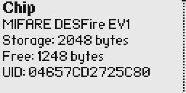<br><b>Card media</b><br><sub>What any card will say about itself with no key involved: chip, UID, storage, manufacture date, applications and files</sub></td>
  </tr>
</table>

### Saving a card

A card only reads while it is against the back of the Flipper. **Save card** at
the bottom of a card's menu writes it to the SD card, and **Saved** on the scan
screen opens the ones already there — the same screens, without the card.

What is saved is not the decoded screens but *what the card said*: the Shell
Environment, the Directory, each product's sector chain and the journey log,
exactly as they came off the card. Loading one runs those bytes back through the
decoder in the build that is running, so a saved card shows whatever the current
Flipso can make of it, and a decoder fix reaches the cards already on the card.

An open saved card can be renamed or deleted from its own menu. The name is the
only part of the file that is yours rather than the card's, so it is the only
part there is anything to change.

Reading a card you have saved before updates that record instead of making a
second copy. Cards are matched by card number rather than by file name, so the
card you called "Mum's bus pass" stays called that, and its balance, season
ticket and journey log come up to date. Flipso says which record it is about to
replace, and when that one was read, before it does it.

Each of the three outcomes has its own chirp, because they happen seconds apart
and you are usually looking at the card rather than the screen: a card **read**
is the firmware's four rising notes in green, a card **kept** is two quick notes
rising, in blue, and a card **thrown out** is the same two falling, in magenta.

They live in `/ext/apps_data/flipso/cards/` as `<name>.flipso`, and the same
file can be replayed through the decoder on a PC:

```bash
tools/test/replay.py card.flipso
```

> A saved card carries the card number, and the holder's name where the card has
> an ITSO ID on it. They are your own cards and the files stay on your SD card,
> but that is what is in them — think before sharing one.

---

## Getting started

### Requirements

- A **Flipper Zero** 
- [**ufbt**](https://github.com/flipperdevices/flipperzero-ufbt), the Flipper
  micro-build tool: `pip install --upgrade ufbt`
- A UK ITSO smartcard to point it at

### Build and install

```bash
ufbt
ufbt launch
```

Station names are packaged with the app and work immediately.

### Bus stop names

The stop table — every active NaPTAN stop in Great Britain — ships ready built
as `data/naptan.dat`, but it is 21 MB and goes on the SD card rather than inside
the `.fap`, because a packaged file is re-uploaded over USB on every install.
Power the Flipper down, take the microSD out, and copy it to:

```
<SD card>/apps_data/flipso/naptan.dat
```

Over USB instead, if you would rather not touch the card — same transfer, about
ten minutes:

```bash
tools/flipper/flipctl push data/naptan.dat /ext/apps_data/flipso/naptan.dat
```

Until it is there, bus locations show as their bare stop codes; nothing else
changes. If you only ever use one area, build that one instead and it will be a
few hundred kilobytes:

```bash
python3 tools/naptan/build_naptan.py --list-areas          # find your area
python3 tools/naptan/build_naptan.py --area 180 -o naptan.dat
```

See [data/README.md](data/README.md) for the detail, and
[tools/naptan/SOURCES.md](tools/naptan/SOURCES.md) for the Open Government
Licence terms the data comes under.

## How it works

### ITSO media types

ITSO defines several customer media and they do not share a command set, so
Flipso has two transports and tries them in turn.

- **DESFire (CMD7 and CMD12 - National Rail, ENCTS)** — select the ITSO
  application, read the Shell Environment, walk the directory, follow the Sector
  Chain Table to read only the files that hold a product. Typically six to ten
  short reads.
- **ISO 7816 (CMD2 - SPT Subway)** — the ITSO application lives in a file system 
  instead.

### Memory

The Flipper has a **190 KB heap**, and a `.fap` is loaded into it whole before
`main()` runs, so we have to be a bit careful particularly with the station table.

```
dist/flipso.fap       170,164 bytes on disk
  .fapassets           78,859   ← station table, never mapped into RAM
  .text                31,712   ← in RAM
  .rodata               9,333   ← in RAM
  (symbols, relocs)    50,260   ← not loaded
  ──────────────────────────
  TOTAL IN RAM         41,045   22% of the heap
```

A card being saved costs a little on top of that, and only while a card is on
screen: the raw blocks are kept in one buffer that grows to fit the card, which
is about a kilobyte for a typical CMD7 one. It is released when the scan screen
comes back.

Both reference tables stay on the SD card and are binary-searched in place, so a
lookup costs a handful of short reads and no memory that grows with the table.
That is what lets the stop table be a hundred times the size of the packaged
station one without costing a byte more to use — the 21 MB is a question of
where the file lives, not of what it costs to read.

## Development

### Tests

```bash
tools/test/run.sh
```

Nine binaries are built and run under **ASan and UBSan**, plus a Python test for
`flipctl`'s serial recovery that needs no Flipper: the decoder against
spec-accurate synthetic CMD7 and CMD2 cards, the save/load round trip against
the same cards and against deliberately broken files, the station table reader
against tables the builder wrote, the stop table reader against both of its
indexes, the operator table and the user's operators file, the card media screen
against a captured Oyster, and the icon list and scrolling text views against an
ASCII framebuffer — which is how their layout, wrapping and scrolling are checked
without a device.

## Contributing

Contributions are welcome — particularly **other media types**, **operator names
and card branding**, **station codes**, and **fixes for cards that do not read**.

An operator entry needs the OID, which the Card screen shows under Issuer. A
brand needs a card that has actually been read, checked against what is printed
on it: the brand is the app's title bar, and a card titled with someone else's
scheme is worse than one titled "ITSO Card".

## ITSO Specification

Field offsets are taken from ITSO TS 1000 version 2.1.5 (March 2025), published
by ITSO Ltd under the Open Government Licence.
