# Flipso architecture

How Flipso is put together, and why it is put together that way. This is the
map: where each responsibility lives, how a card gets from the reader to the
screen, the data structures it passes through, and the design decisions that
shaped them.

The other documents cover what this one does not:

- [`README.md`](../README.md) - what the app is and what each screen shows.
- [`PROTOCOL.md`](PROTOCOL.md) - how each card is read, field by field, and
  which part of the ITSO specification each comes from.
- [`GLOSSARY.md`](GLOSSARY.md) - what the railway, ITSO and NFC terms mean.
- [`CLAUDE.md`](../CLAUDE.md) - the development loop, the hardware, and the
  traps that have cost time before.

Contents:

- [The shape of the app](#the-shape-of-the-app)
- [Source layout](#source-layout)
- [A card's journey through the app](#a-cards-journey-through-the-app)
- [Reading a card](#reading-a-card)
- [The decoder](#the-decoder)
- [Data structures](#data-structures)
- [The capture and saved cards](#the-capture-and-saved-cards)
- [Screens](#screens)
- [Lookup tables](#lookup-tables)
- [Memory](#memory)
- [Testing](#testing)
- [Design decisions](#design-decisions)

## The shape of the app

Flipso is a Flipper Zero external app (`.fap`) written in C against the
firmware SDK. It is built in layers, and the rule that matters most is which
layers may see the firmware: everything in the "Pure C" box is plain C with
no firmware headers, so it builds and runs on a laptop under AddressSanitizer
and UndefinedBehaviorSanitizer.

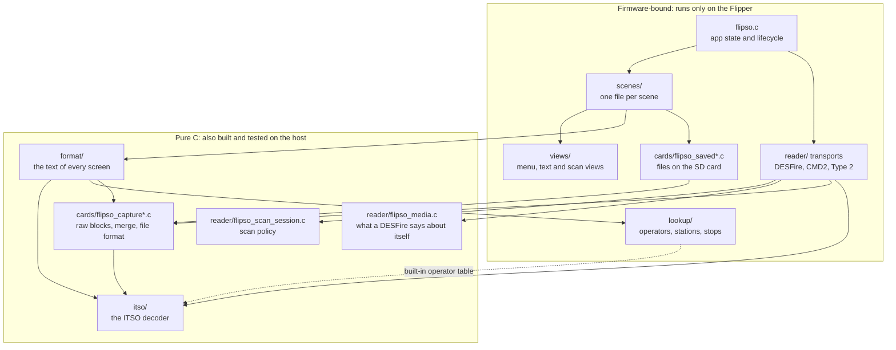
```mermaid
flowchart TB
    subgraph device["Firmware-bound: runs only on the Flipper"]
        app["flipso.c<br/>app state and lifecycle"]
        scenes["scenes/<br/>one file per scene"]
        views["views/<br/>menu, text and scan views"]
        reader["reader/ transports<br/>DESFire, CMD2, Type 2"]
        saved["cards/flipso_saved*.c<br/>files on the SD card"]
        lookup["lookup/<br/>operators, stations, stops"]
    end

    subgraph host["Pure C: also built and tested on the host"]
        format["format/<br/>the text of every screen"]
        session["reader/flipso_scan_session.c<br/>scan policy"]
        media["reader/flipso_media.c<br/>what a DESFire says about itself"]
        capture["cards/flipso_capture*.c<br/>raw blocks, merge, file format"]
        itso["itso/<br/>the ITSO decoder"]
    end

    app --> scenes
    scenes --> views
    scenes --> format
    scenes --> saved
    app --> reader
    reader --> session
    reader --> media
    reader --> capture
    reader --> itso
    saved --> capture
    capture --> itso
    format --> itso
    format --> lookup
    format --> capture
    lookup -.->|"built-in operator table"| itso
```

`format/` and `lookup/` are drawn on either side of the line because each
straddles it: `format/` uses only furi's strings and the locale service, which
the host tests stub, and the lookups are tested on the host against stubbed
storage. `itso/` is the strictest case - it includes nothing from the firmware
at all - and `CLAUDE.md` makes that a rule.

## Source layout

Each directory holds one responsibility, and inside it each file holds one
part of that responsibility: a file per medium, per product family, per
screen, per transport, per test topic. A file growing past a few hundred lines
is usually two.

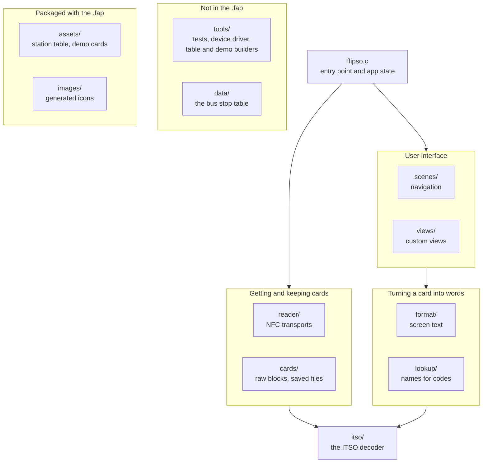
```mermaid
flowchart TB
    app["flipso.c<br/>entry point and app state"]
    subgraph ui["User interface"]
        scenes["scenes/<br/>navigation"]
        views["views/<br/>custom views"]
    end
    subgraph data["Getting and keeping cards"]
        reader["reader/<br/>NFC transports"]
        cards["cards/<br/>raw blocks, saved files"]
    end
    subgraph words["Turning a card into words"]
        format["format/<br/>screen text"]
        lookup["lookup/<br/>names for codes"]
    end
    itso["itso/<br/>the ITSO decoder"]
    subgraph support["Not in the .fap"]
        tools["tools/<br/>tests, device driver,<br/>table and demo builders"]
        data2["data/<br/>the bus stop table"]
    end
    subgraph packaged["Packaged with the .fap"]
        assets["assets/<br/>station table, demo cards"]
        images["images/<br/>generated icons"]
    end
    app --> ui
    app --> data
    ui --> words
    data --> itso
    words --> itso
```

The files in each, one responsibility to a file:

```
flipso.c, flipso.h          entry point, the Flipso struct, the icon table, loading a saved card

itso/                       the decoder - pure C, no firmware headers
  itso.h                      the one header the rest of the app includes
  itso_card.c                 the card, and the arrays it owns
  itso_log.c                  the cyclic log's journey records
  itso_location.c             LocDefTypes: a location's text and lookup code
  itso_names.c                coded values to words
  itso_operators.c            the built-in OID table
  itso_util.c                 bit fields, dates, money
  media/                      the card as storage
    itso_shell.c                Shell Environment
    itso_directory.c            directory, Sector Chain Table, chains, log sectors
    itso_type2.c                Type 2 tag layouts: CMD4, CMD9, CMD10
    itso_cmd4.c                 paper tickets
  ipe/                        what a product holds
    itso_ipe.c                  elements every IPE shares, and the table of types
    itso_ipe_<kind>.c           one per family: purse, id, period, journey,
                                reservation, voucher, loyalty
    itso_value.c                value records
    itso_capping.c              the capping extension, decoded on demand
    itso_space_saving.c         TYP 27-29 paper tickets

reader/                     getting a card off the reader
  flipso_reader.c             the pollers and their lifecycle
  flipso_scan_session.c       which transport next, retries, the verdict (pure C)
  flipso_transport.c          the product and log walk the transports share
  flipso_desfire.c            DESFire: CMD7 and CMD12
  flipso_cmd2.c               ISO 7816: CMD2
  flipso_type2.c              NFC Type 2 tags: CMD4, CMD9, CMD10
  flipso_media.c              the model of what a DESFire says about itself (pure C)
  flipso_desfire_media.c      reading that from a non-ITSO DESFire, such as an Oyster

cards/                      a read's raw blocks, and the files they are saved as
  flipso_capture.c            the block store (pure C, as are the next three)
  flipso_capture_decode.c     blocks to an ItsoCard
  flipso_capture_merge.c      merging with an earlier file of the same card
  flipso_capture_file.c       the file format, a line at a time
  flipso_saved.c              writing, reading, browsing, renaming, deleting
  flipso_saved_recover.c      finishing or undoing a save a power cut stopped
  flipso_saved_demos.c        the packaged demo cards
  flipso_name_validator.c     the rule a saved card's name follows

format/                     the text of every screen
  flipso_format_<screen>.c    summary, card, journeys, media, about
  flipso_format_lines.c       line builders the screens share
  product/                    the product, Pay as you go and ID screens
    flipso_product_pages.c      which pages each kind has, in what order
    flipso_product_<part>.c     details, technical, history, lines
    flipso_product_<kind>.c     purse, id, ticket, reservation, legs, space_saving

lookup/                     names for codes, from tables on the SD card
  flipso_operators.c          OID to operator and brand: built-in table and the user's file
  flipso_stations.c           NLC to station
  flipso_naptan.c             NaptanCode and AtcoCode to bus stop

scenes/                     one file per scene; the list is flipso_scene_config.h
views/                      the icon list, the paged text panel, the scan screen,
                            and the hand-drawn £ and € the fonts lack
```

`application.fam` lists every source explicitly. A bare `*.c` would match the
host tests under `tools/` too, and `dir/*.c` takes any directory of that name
anywhere in the tree, so no directory under `tools/` may share a name with an
app directory. The host builds take their source lists from
`tools/test/sources.py` rather than keeping their own.

## A card's journey through the app

A card reaches the screen by one of two routes - a tap, or a file - and both
end the same way: raw bytes in a `FlipsoCapture`, decoded into an `ItsoCard`,
rendered to text by `format/`, and shown by the one text view.

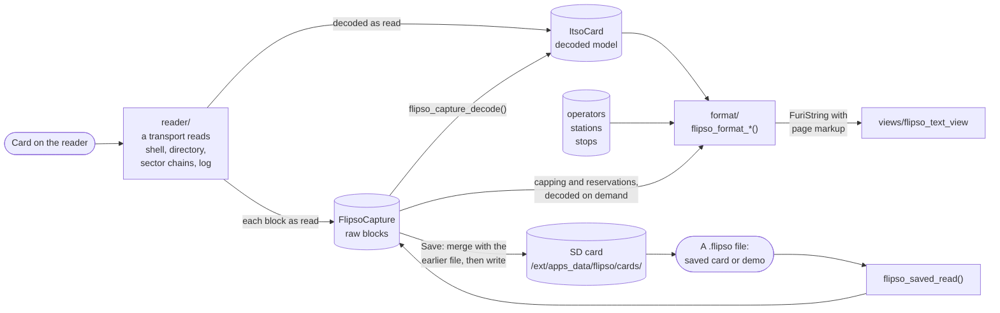
```mermaid
flowchart LR
    tap(["Card on the reader"]) --> reader["reader/<br/>a transport reads<br/>shell, directory,<br/>sector chains, log"]
    file(["A .flipso file:<br/>saved card or demo"]) --> savedread["flipso_saved_read()"]

    reader -->|"each block as read"| capture[("FlipsoCapture<br/>raw blocks")]
    reader -->|"decoded as read"| card
    savedread --> capture
    capture -->|"flipso_capture_decode()"| card[("ItsoCard<br/>decoded model")]

    card --> format["format/<br/>flipso_format_*()"]
    lookups[("operators<br/>stations<br/>stops")] --> format
    capture -->|"capping and reservations,<br/>decoded on demand"| format
    format -->|"FuriString with<br/>page markup"| textview["views/flipso_text_view"]

    capture -->|"Save: merge with the<br/>earlier file, then write"| disk[("SD card<br/>/ext/apps_data/flipso/cards/")]
    disk --> file
```

Two properties of this flow are deliberate:

- **The capture, not the card, is what is saved.** Loading a file runs the
  bytes through the decoder that is installed now, so a decoder fix reaches
  every card already saved. See [Design decisions](#design-decisions).
- **A live read builds the capture too**, and for the Type 2 tags with a full
  shell the live read decodes *from* the capture, so a saved card cannot
  decode differently from the tap that produced it.

## Reading a card

### Threads

The NFC stack runs its pollers on a worker thread. Flipso keeps that thread's
part to the minimum: a poller callback runs one transport's read, records a
status and posts an event. Everything else - stopping the poller, deciding
what comes next, starting the next transport, changing scene - happens on the
UI thread, because a poller cannot stop itself.

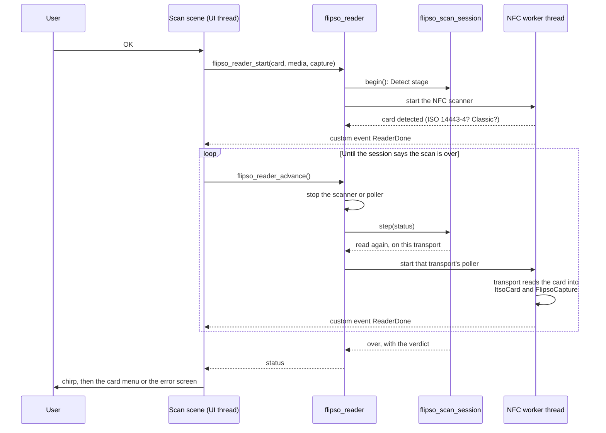
```mermaid
sequenceDiagram
    participant User
    participant Scan as Scan scene (UI thread)
    participant Reader as flipso_reader
    participant Session as flipso_scan_session
    participant Worker as NFC worker thread

    User->>Scan: OK
    Scan->>Reader: flipso_reader_start(card, media, capture)
    Reader->>Session: begin(): Detect stage
    Reader->>Worker: start the NFC scanner
    Worker-->>Reader: card detected (ISO 14443-4? Classic?)
    Worker-->>Scan: custom event ReaderDone
    loop Until the session says the scan is over
        Scan->>Reader: flipso_reader_advance()
        Reader->>Reader: stop the scanner or poller
        Reader->>Session: step(status)
        Session-->>Reader: read again, on this transport
        Reader->>Worker: start that transport's poller
        Worker->>Worker: transport reads the card into<br/>ItsoCard and FlipsoCapture
        Worker-->>Scan: custom event ReaderDone
    end
    Session-->>Reader: over, with the verdict
    Reader-->>Scan: status
    Scan->>User: chirp, then the card menu or the error screen
```

A Back press can leave a `ReaderDone` event in the queue after the scan has
been cancelled, so the scan scene ignores one that arrives when it is not
scanning - otherwise it would restart the reader behind an idle screen.

### The scan policy

Which transport to try next, when to retry, and what to conclude are the most
intricate logic in the app, and none of it is NFC. It lives in
`flipso_scan_session.c`, which the host tests drive through every path a real
card takes (`tools/test/test_scan_session.c`).

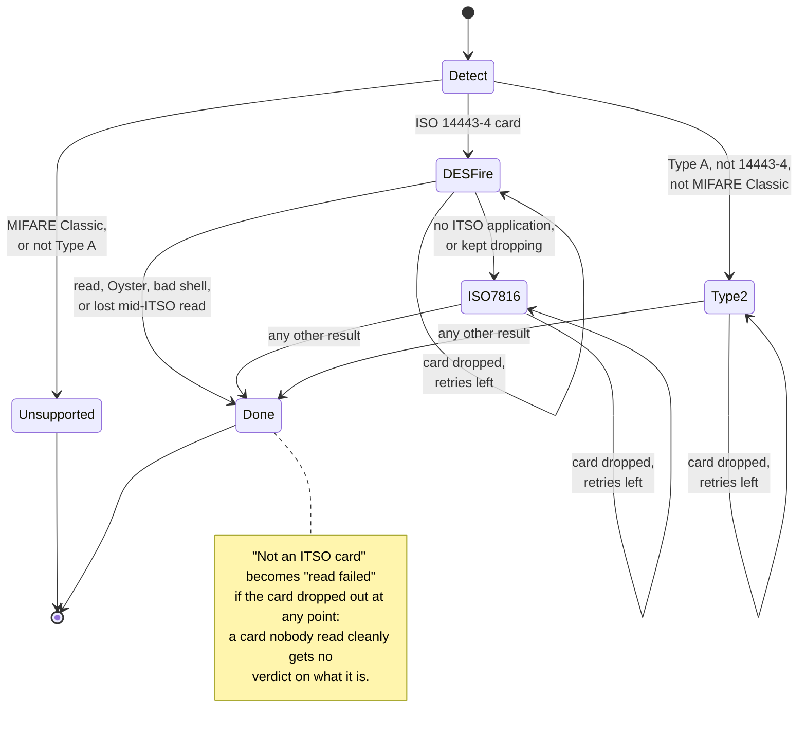
```mermaid
stateDiagram-v2
    [*] --> Detect
    Detect --> DESFire: ISO 14443-4 card
    Detect --> Type2: Type A, not 14443-4,<br/>not MIFARE Classic
    Detect --> Unsupported: MIFARE Classic,<br/>or not Type A

    DESFire --> DESFire: card dropped,<br/>retries left
    DESFire --> ISO7816: no ITSO application,<br/>or kept dropping
    DESFire --> Done: read, Oyster, bad shell,<br/>or lost mid-ITSO read

    ISO7816 --> ISO7816: card dropped,<br/>retries left
    ISO7816 --> Done: any other result

    Type2 --> Type2: card dropped,<br/>retries left
    Type2 --> Done: any other result

    Unsupported --> [*]
    Done --> [*]

    note right of Done
        "Not an ITSO card" becomes "read failed"
        if the card dropped out at any point:
        a card nobody read cleanly gets no
        verdict on what it is.
    end note
```

Two of these rules came from real failures:

- **A -4 transport is never started on a Type 2 tag.** It sends a RATS the tag
  cannot answer and polls for ever. The detect stage exists to prevent that.
- **`CardLost` does not move on to the next transport.** It means the ITSO
  application had already been selected when the card went, so this transport
  is the right one. Moving on once produced "Not an ITSO card" for a card that
  had just named its operator.

### Transports

Each transport addresses the card differently, but once the shell and
directory are in hand they all walk the products and the log the same way.
That walk lives once, in `flipso_transport_read_groups()`, behind a small
interface each transport fills in:

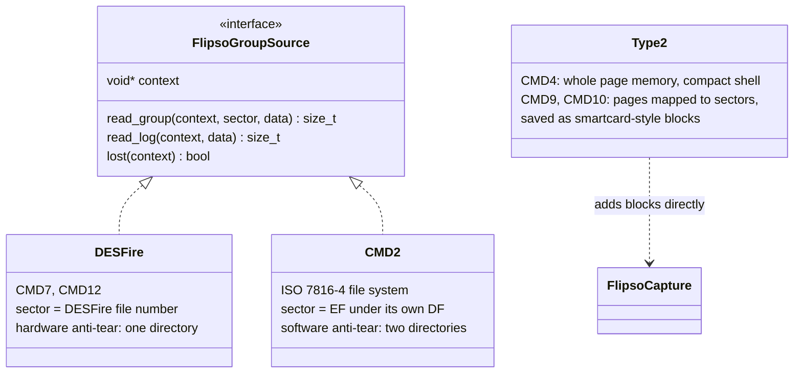
```mermaid
classDiagram
    class FlipsoGroupSource {
        <<interface>>
        read_group(context, sector, data) size_t
        read_log(context, data) size_t
        lost(context) bool
        void* context
    }
    class DESFire {
        CMD7, CMD12
        sector = DESFire file number
        hardware anti-tear: one directory
    }
    class CMD2 {
        ISO 7816-4 file system
        sector = EF under its own DF
        software anti-tear: two directories
    }
    class Type2 {
        CMD4: whole page memory, compact shell
        CMD9, CMD10: pages mapped to sectors,
        saved as smartcard-style blocks
    }
    FlipsoGroupSource <|.. DESFire
    FlipsoGroupSource <|.. CMD2
    Type2 ..> FlipsoCapture : adds blocks directly
```

A product that cannot be read stops the walk with `CardLost` rather than
being skipped. Finishing would chirp success over a card whose directory names
products with nothing behind them; asking for another tap is better.

Per-transport detail - commands, file numbers, page maps - is in
[How it reads the card](PROTOCOL.md#how-it-reads-the-card).

## The decoder

`itso/` turns bytes into an `ItsoCard`. It follows the layers of the ITSO
specification: the medium (TS 1000-10) holds a shell and a directory
(TS 1000-2), the directory names products (IPEs), and each product's dataset is
defined per type (TS 1000-5).

### From card bytes to structures

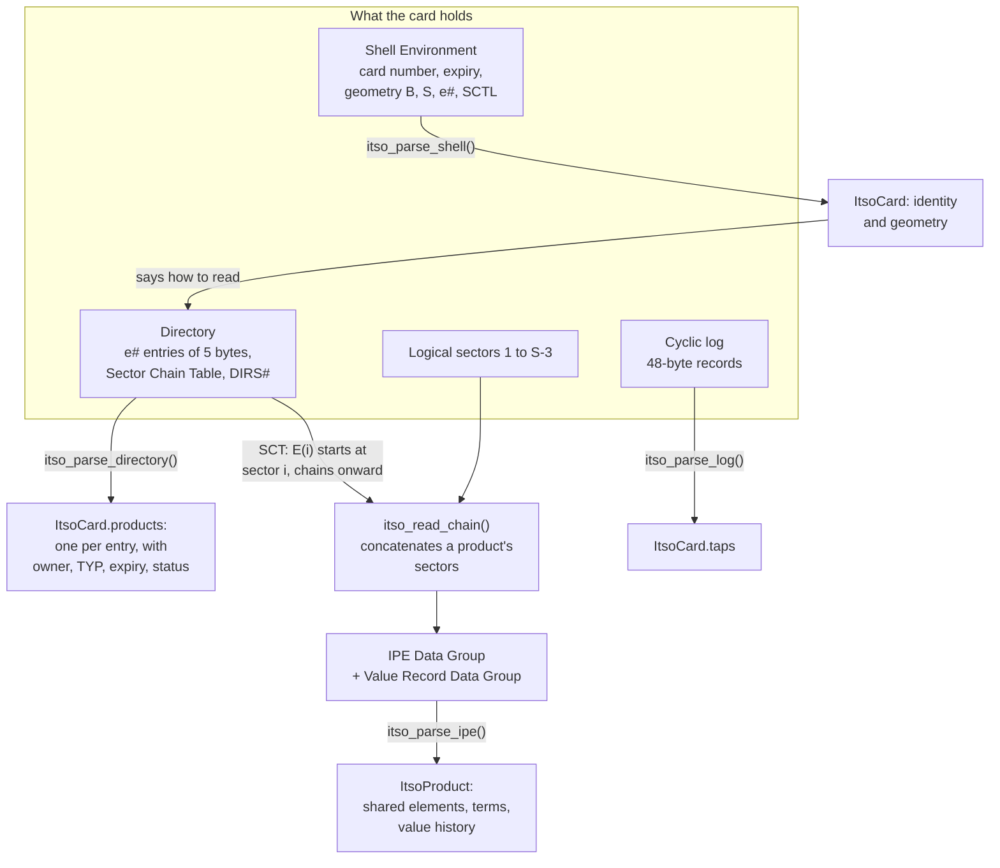
```mermaid
flowchart TB
    subgraph cardbytes["What the card holds"]
        shell["Shell Environment<br/>card number, expiry,<br/>geometry B, S, e#, SCTL"]
        dir["Directory<br/>e# entries of 5 bytes,<br/>Sector Chain Table, DIRS#"]
        sectors["Logical sectors 1 to S-3"]
        log["Cyclic log<br/>48-byte records"]
    end

    shell -->|"itso_parse_shell()"| geometry["ItsoCard: identity<br/>and geometry"]
    geometry -->|"says how to read"| dir
    dir -->|"itso_parse_directory()"| entries["ItsoCard.products:<br/>one per entry, with<br/>owner, TYP, expiry, status"]
    dir -->|"SCT: E(i) starts at<br/>sector i, chains onward"| chain["itso_read_chain()<br/>concatenates a product's<br/>sectors"]
    sectors --> chain
    chain --> group["IPE Data Group<br/>+ Value Record Data Group"]
    group -->|"itso_parse_ipe()"| product["ItsoProduct:<br/>shared elements, terms,<br/>value history"]
    log -->|"itso_parse_log()"| taps["ItsoCard.taps"]
```

The geometry is read from the shell, never assumed: real CMD2 cards use
80-byte sectors where the specification's default is 48, and a decoder that
assumed the default would misplace every sector after the first.

### One table of product types

`itso_parse_ipe()` decodes what every IPE shares - the directory entry, the
InstanceID, the optional elements the bitmap announces - and then looks the
type up in one table, `itso_ipe_types[]` in `itso_ipe.c`. Each row says which
family of terms the type fills and which two functions decode it: one for the
dataset, one for the tail of the live value record.

| TYP | Family | Dataset decoder | Value record decoder |
| --- | --- | --- | --- |
| 2, 4, 5 | Purse | `itso_ipe_purse_dataset` | per type |
| 3 | Other | - | `itso_ipe_loyalty_value` |
| 14, 16 | Id | `itso_ipe_id_dataset` | - |
| 22 | Ticket | `itso_ipe_period_dataset` | `itso_ipe_period_value` |
| 23 | Ticket | `itso_ipe_journey_dataset` | `itso_ipe_journey_value` |
| 24 | Ticket | `itso_ipe_reservation_dataset` | `itso_ipe_reservation_value` |
| 25 | Ticket | `itso_ipe_voucher_dataset` | `itso_ipe_voucher_value` |
| 26 | Other | - | `itso_ipe_voucher_value` |
| 27, 28, 29 | Ticket | `itso_parse_space_saving()`, called by the CMD4 path | - |

A type not in the table is still listed, from its directory entry and its
value record's common header. Adding a type means a row here and a file
`itso_ipe_<kind>.c`, not a new branch in a switch somewhere.

### Decoded on demand

Some structures are too large, or too rarely looked at, to keep decoded in
every product: the fare capping extension (four accumulator sets) and a TYP 24's
reservations and legs. These are decoded from the capture's raw group by the
screen that shows them, into memory that screen frees before the text is
displayed:

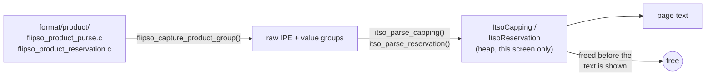
```mermaid
flowchart LR
    screen["format/product/<br/>flipso_product_purse.c<br/>flipso_product_reservation.c"] -->|"flipso_capture_product_group()"| raw["raw IPE + value groups"]
    raw -->|"itso_parse_capping()<br/>itso_parse_reservation()"| temp["ItsoCapping /<br/>ItsoReservation<br/>(heap, this screen only)"]
    temp --> text["page text"]
    temp -->|"freed before the<br/>text is shown"| gone(("free"))
```

Locations follow the same idea at a smaller scale: an `ItsoLocation` keeps the
record's bytes, and `itso_location_text()` renders it when a screen draws it.

## Data structures

### The app

`Flipso` (in `flipso.h`) is the one piece of state every scene shares. It owns
the views, the reader, the lookups, the card on screen and the capture behind
it.

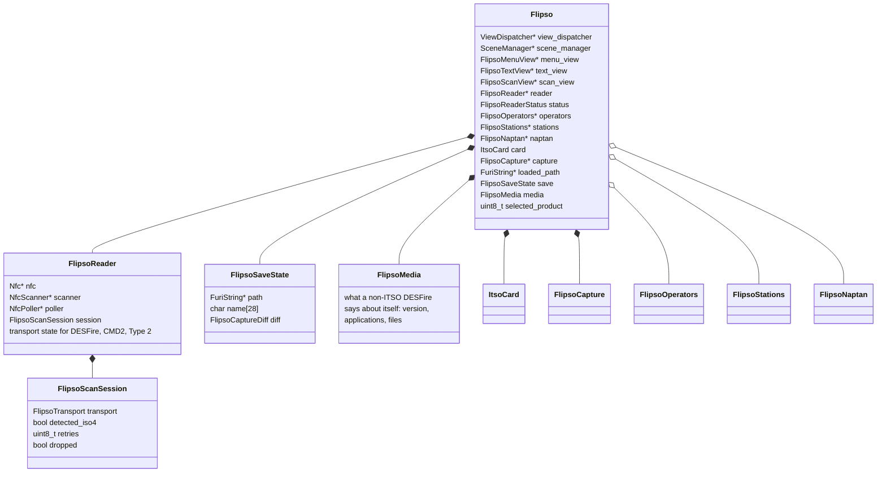
```mermaid
classDiagram
    class Flipso {
        ViewDispatcher* view_dispatcher
        SceneManager* scene_manager
        FlipsoMenuView* menu_view
        FlipsoTextView* text_view
        FlipsoScanView* scan_view
        FlipsoReader* reader
        FlipsoReaderStatus status
        FlipsoOperators* operators
        FlipsoStations* stations
        FlipsoNaptan* naptan
        ItsoCard card
        FlipsoCapture* capture
        FuriString* loaded_path
        FlipsoSaveState save
        FlipsoMedia media
        uint8_t selected_product
    }
    class FlipsoReader {
        Nfc* nfc
        NfcScanner* scanner
        NfcPoller* poller
        FlipsoScanSession session
        transport state for DESFire, CMD2, Type 2
    }
    class FlipsoScanSession {
        FlipsoTransport transport
        bool detected_iso4
        uint8_t retries
        bool dropped
    }
    class FlipsoSaveState {
        FuriString* path
        char name[28]
        FlipsoCaptureDiff diff
    }
    class FlipsoMedia {
        what a non-ITSO DESFire
        says about itself: version,
        applications, files
    }
    Flipso *-- FlipsoReader
    FlipsoReader *-- FlipsoScanSession
    Flipso *-- ItsoCard
    Flipso *-- FlipsoCapture
    Flipso *-- FlipsoSaveState
    Flipso *-- FlipsoMedia
    Flipso o-- FlipsoOperators
    Flipso o-- FlipsoStations
    Flipso o-- FlipsoNaptan
```

`loaded_path` is empty for a card that was just tapped and holds the file's
path for one that was loaded. The card menu reads it to offer Save for the
first and Rename and Delete for the second.

### The card

`ItsoCard` is everything the decoder knows about one card. It is a value type
with three owned arrays, each allocated to fit what the card holds.

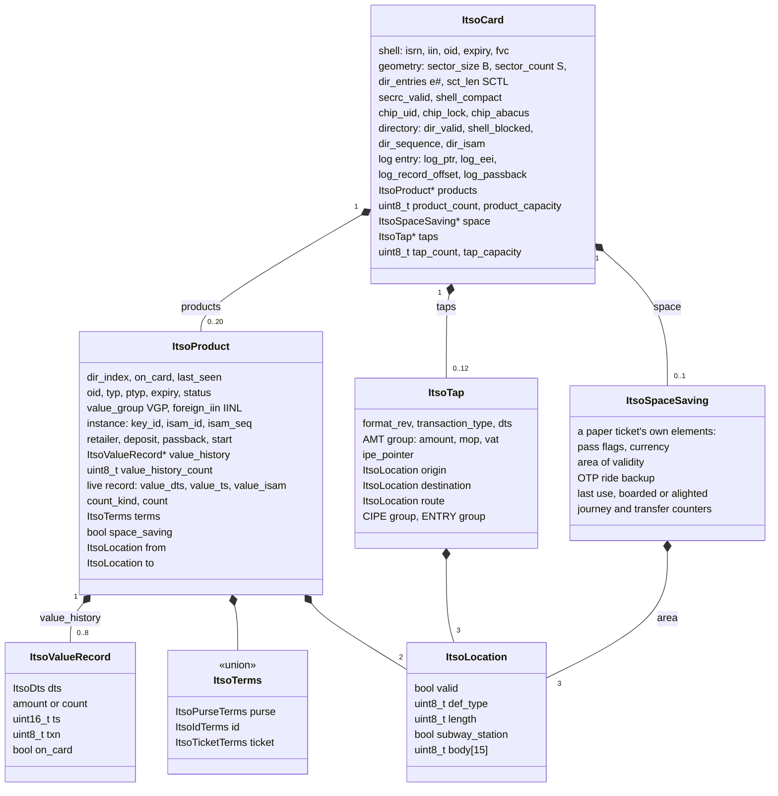
```mermaid
classDiagram
    class ItsoCard {
        shell: isrn, iin, oid, expiry, fvc
        geometry: sector_size B, sector_count S,
        dir_entries e#, sct_len SCTL
        secrc_valid, shell_compact
        chip_uid, chip_lock, chip_abacus
        directory: dir_valid, shell_blocked,
        dir_sequence, dir_isam
        log entry: log_ptr, log_eei,
        log_record_offset, log_passback
        ItsoProduct* products
        uint8_t product_count, product_capacity
        ItsoSpaceSaving* space
        ItsoTap* taps
        uint8_t tap_count, tap_capacity
    }
    class ItsoProduct {
        dir_index, on_card, last_seen
        oid, typ, ptyp, expiry, status
        value_group VGP, foreign_iin IINL
        instance: key_id, isam_id, isam_seq
        retailer, deposit, passback, start
        ItsoValueRecord* value_history
        uint8_t value_history_count
        live record: value_dts, value_ts, value_isam
        count_kind, count
        ItsoTerms terms
        bool space_saving
        ItsoLocation from
        ItsoLocation to
    }
    class ItsoTerms {
        <<union>>
        ItsoPurseTerms purse
        ItsoIdTerms id
        ItsoTicketTerms ticket
    }
    class ItsoValueRecord {
        ItsoDts dts
        amount or count
        uint16_t ts
        uint8_t txn
        bool on_card
    }
    class ItsoTap {
        format_rev, transaction_type, dts
        AMT group: amount, mop, vat
        ipe_pointer
        ItsoLocation origin
        ItsoLocation destination
        ItsoLocation route
        CIPE group, ENTRY group
    }
    class ItsoLocation {
        bool valid
        uint8_t def_type
        uint8_t length
        bool subway_station
        uint8_t body[15]
    }
    class ItsoSpaceSaving {
        a paper ticket's own elements:
        pass flags, currency
        area of validity
        OTP ride backup
        last use, boarded or alighted
        journey and transfer counters
    }
    ItsoCard "1" *-- "0..20" ItsoProduct : products
    ItsoCard "1" *-- "0..12" ItsoTap : taps
    ItsoCard "1" *-- "0..1" ItsoSpaceSaving : space
    ItsoProduct "1" *-- "0..8" ItsoValueRecord : value_history
    ItsoProduct *-- ItsoTerms
    ItsoProduct *-- "2" ItsoLocation
    ItsoTap *-- "3" ItsoLocation
    ItsoSpaceSaving *-- "3" ItsoLocation : area
```

Points of design in this model:

- **Products come first in directory order, then the ones the card has
  dropped.** A screen that walks the array in order shows the card as it is
  before it shows the card's past. The cap is 16 live plus 4 dropped.
- **`ItsoTerms` is a union of the three families**, chosen by TYP through
  `itso_product_family()`. Before the union every product carried every type's
  fields; with the value records and locations moved out as below, that
  brought a product down from 672 bytes to 268 on the device.
  Accessors (`itso_product_purse()`, `_id()`, `_ticket()`) return NULL for the
  wrong family, so a screen cannot read a ticket's terms out of a purse.
- **Value records belong to their product** and are allocated to fit: two on
  most products, none on an ID, up to eight on a saved card that remembers more
  than the card keeps. The live record is decoded into the product's own fields;
  `value_history` is every record, newest first, for the History page.
- **A location is kept as the card's bytes** (`body`, 15 bytes), not as text.
  There are three in every tap and two in every product, and only the screen
  showing one needs its text.
- **`ItsoSpaceSaving` exists only on a paper ticket**, so it is a pointer
  allocated when one decodes rather than a member every card carries.

Ownership is explicit: `itso_card_init()` makes an empty card, and
`itso_card_reset()` frees the products, each product's history, the taps and
the space. A card copied by struct assignment shares all of them, so only one
copy may be reset.

## The capture and saved cards

### The capture

A `FlipsoCapture` is the raw bytes a card gave up, as an index of blocks over
one growing arena.

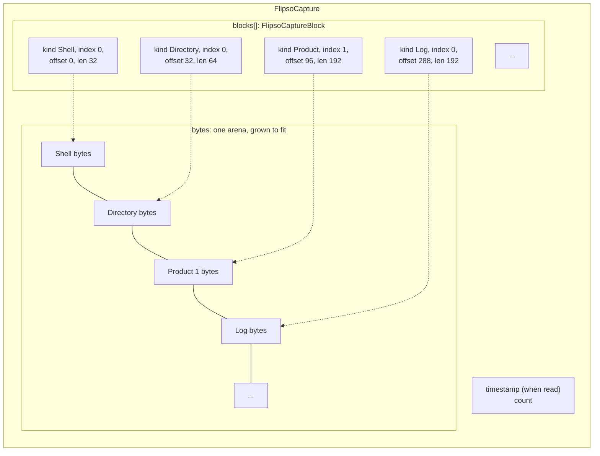
```mermaid
flowchart TB
    subgraph capture["FlipsoCapture"]
        direction TB
        meta["timestamp (when read)<br/>count"]
        subgraph index["blocks[]: FlipsoCaptureBlock"]
            b0["kind Shell, index 0,<br/>offset 0, len 32"]
            b1["kind Directory, index 0,<br/>offset 32, len 64"]
            b2["kind Product, index 1,<br/>offset 96, len 192"]
            b3["kind Log, index 0,<br/>offset 288, len 192"]
            bn["..."]
        end
        subgraph arena["bytes: one arena, grown to fit"]
            a0["Shell bytes"] --- a1["Directory bytes"] --- a2["Product 1 bytes"] --- a3["Log bytes"] --- an["..."]
        end
    end
    b0 -.-> a0
    b1 -.-> a1
    b2 -.-> a2
    b3 -.-> a3
```

The block kinds are what the card said this read (`Shell`, `Directory`,
`Product n`, `Log`, `Chip`, `Type 2`, `Tag`) and what earlier reads of the same
card said that this one did not (`Log history`, `Value history n`,
`Product history n`). The history blocks are raw card bytes too, so they go
through the same decoder as everything else. The arena starts small and grows
towards a ceiling: a DESFire card fills about a tenth of it.

### Merging with the earlier file

A card keeps a rolling window - four journey records on a DESFire, two value
records per product - so writing a fresh file on every save would throw away
everything that has rolled off since. Saving over an existing record merges
instead:

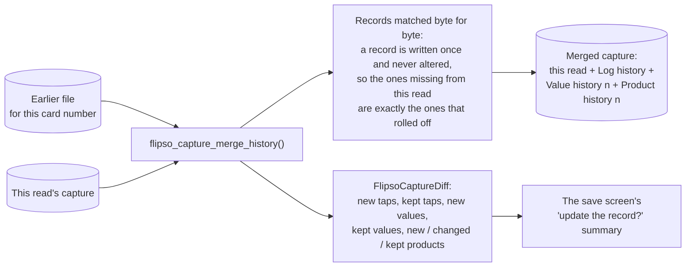
```mermaid
flowchart LR
    old[("Earlier file<br/>for this card number")] --> merge["flipso_capture_merge_history()"]
    new[("This read's capture")] --> merge
    merge --> rules["Records matched byte for byte:<br/>a record is written once and never altered,<br/>so the ones missing from this read<br/>are exactly the ones that rolled off"]
    rules --> out[("Merged capture:<br/>this read + Log history +<br/>Value history n + Product history n")]
    merge --> diff["FlipsoCaptureDiff:<br/>new taps, kept taps, new values,<br/>kept values, new / changed / kept products"]
    diff --> prompt["The save screen's<br/>'update the record?' summary"]
```

Cards are matched by card number, not by file name, because the user named the
file. Value records are carried forward only for a directory entry whose five
entry bytes are unchanged, so a ticket that expired and was replaced in the same
slot does not lend its transactions to the new one; the old ticket is kept whole
as a `Product history` block instead. Merging is idempotent.

### The file

A saved card is a text file in the firmware's key-and-hex style, one block per
line, under `/ext/apps_data/flipso/cards/NAME.flipso`:

```
Filetype: Flipso card
Version: 1
Read at: 1791189000
Shell: 18 11 63 35 97 ...
Directory: ...
Product 1: ...
Product 2: ...
Log: ...
Chip: ...
Log history: ...
Value history 1: ...
Product history 100: ...
```

It is written and read a line at a time, so neither direction needs the whole
file in memory; the longest line is about 1.5 KB, which lives on the heap
because the app's stack is 4 KB. The same file is what `tools/test/replay.py`
reads, so a saved card is also a host test case.

### Saving without losing a card to a power cut

Updating a card overwrites the only copy of the journeys that have rolled off
it, so the write is arranged so that there is always one whole copy under a
name the app knows:

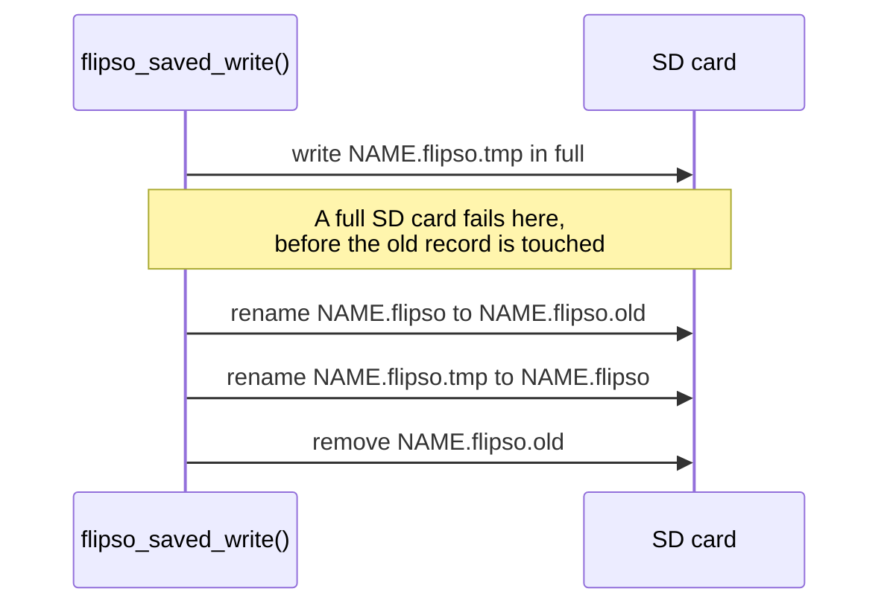
```mermaid
sequenceDiagram
    participant Save as flipso_saved_write()
    participant SD as SD card

    Save->>SD: write NAME.flipso.tmp in full
    Note over Save,SD: A full SD card fails here,<br/>before the old record is touched
    Save->>SD: rename NAME.flipso to NAME.flipso.old
    Save->>SD: rename NAME.flipso.tmp to NAME.flipso
    Save->>SD: remove NAME.flipso.old
```

On every launch, before anything lists the cards, `flipso_saved_recover()`
finishes or undoes whatever a power cut interrupted: an `.old` with no card
beside it is replaced by its `.tmp` if one is whole, or put back if not; a
`.ren` left by a change of case goes back under its name; any remaining `.tmp`
is removed, because it may be the front of a file cut short. None of the
suffixes is the card extension, so the file browser never shows a leftover.

## Screens

### Scenes

Navigation uses the firmware's scene manager. Every paged text screen - the
Summary, Card, Pay as you go, ID, Journeys, a product, a non-ITSO card's
details and About - is the one `text` scene, told which screen to build through
its scene state (`flipso_open_text()`).

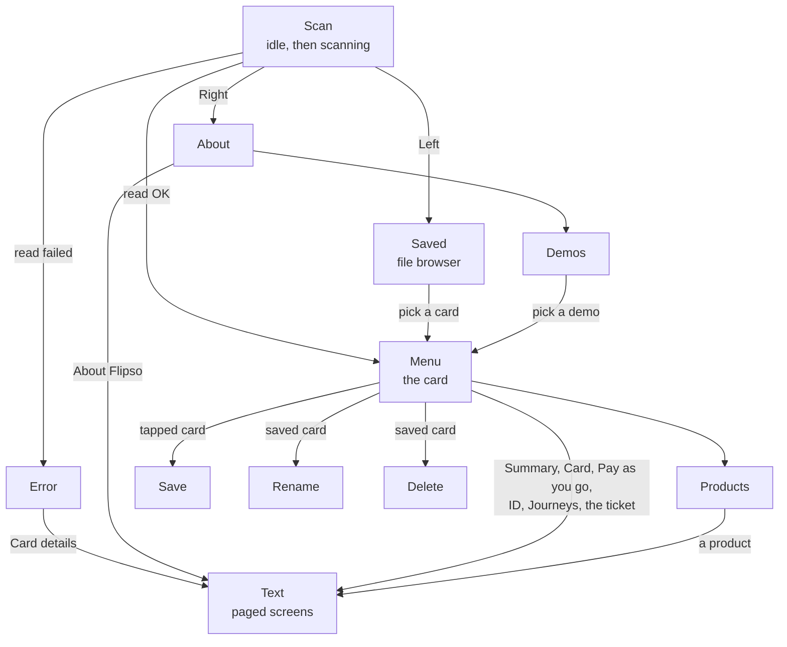
```mermaid
flowchart TB
    scan["Scan<br/>idle, then scanning"] -->|"read OK"| menu["Menu<br/>the card"]
    scan -->|"read failed"| error["Error"]
    scan -->|"Left"| saved["Saved<br/>file browser"]
    scan -->|"Right"| about["About"]
    error -->|"Card details"| text
    saved -->|"pick a card"| menu
    about -->|"About Flipso"| text["Text<br/>paged screens"]
    about --> demos["Demos"]
    demos -->|"pick a demo"| menu
    menu -->|"Summary, Card, Pay as you go,<br/>ID, Journeys, the ticket"| text
    menu --> products["Products"]
    products -->|"a product"| text
    menu -->|"tapped card"| save["Save"]
    menu -->|"saved card"| rename["Rename"]
    menu -->|"saved card"| delete["Delete"]
```

Scenes stay thin: they own no text. The words on every screen are built in
`format/` from an `ItsoCard` and a `FlipsoFormat` context (the lookups, the
capture, the chip description and the time), and the scene hands the result to
the text view. That is what lets `tools/test/screen_text/` hold every screen of
every demo card to the house style on the host.

### Pages

Every text screen is a set of pages, turned with Left and Right. The text view
takes one string: `\f` starts a page and `\e#` plus an icon byte starts its
title, which stays fixed while the page scrolls beneath it.

A product's screen is assembled through a level of indirection, so the same
line builders serve every kind of product while each kind decides its own page
order. Builders write to *slots* - what a line is about - and
`flipso_product_pages.c` maps each slot to a *page* for the product's kind:

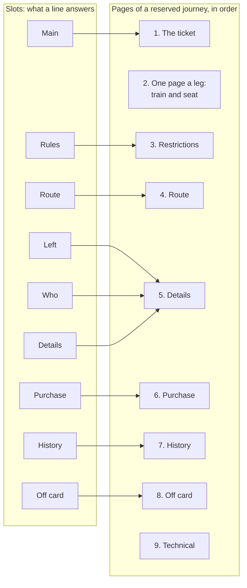
```mermaid
flowchart LR
    subgraph slots["Slots: what a line answers"]
        sMain["Main"]
        sLeft["Left"]
        sRules["Rules"]
        sWho["Who"]
        sRoute["Route"]
        sDetails["Details"]
        sPurchase["Purchase"]
        sHistory["History"]
        sOff["Off card"]
    end
    subgraph pages["Pages of a reserved journey, in order"]
        pMain["1. The ticket"]
        pLegs["2. One page a leg:<br/>train and seat"]
        pRules["3. Restrictions"]
        pRoute["4. Route"]
        pDetails["5. Details"]
        pPurchase["6. Purchase"]
        pHistory["7. History"]
        pOff["8. Off card"]
        pTech["9. Technical"]
    end
    sMain --> pMain
    sRules --> pRules
    sRoute --> pRoute
    sLeft --> pDetails
    sWho --> pDetails
    sDetails --> pDetails
    sPurchase --> pPurchase
    sHistory --> pHistory
    sOff --> pOff
```

The leg pages are built from the reservations, decoded on demand, and
Technical is added by the caller, so neither comes through a slot. A purse maps
Rules, Who, Route and Details all onto its Left page (titled Top-up) and Purchase
onto Main; an ID puts Purchase with its Rules; and so on. Empty pages are
dropped, and Technical is always last. `tools/test/screen_text/` pins each
kind's page order and checks every page is titled and non-empty.

### Views

| View | File | What it is for |
| --- | --- | --- |
| Scan | `views/flipso_scan_view.c` | The idle prompt and the scanning animation; Left and Right open Saved cards and About. |
| Menu | `views/flipso_menu_view.c` | A list of rows with icons and right-hand tags, under a header titled with the card's brand. |
| Text | `views/flipso_text_view.c` | Paged, word-wrapping text. The firmware's text box breaks words mid-way, which splits the long operator and station names Flipso shows all the time. |
| Widget, Text input | firmware | The error screen, and the name entry for save and rename. |

## Lookup tables

Operators, stations and bus stops are named from tables, none of which is held
in memory whole.

| Table | Source | Where it lives | How it is searched |
| --- | --- | --- | --- |
| Operators | Built-in `itso_operators.c`, plus the user's `operators.txt` | Built-in in the `.fap`; the user's file read at launch, capped at 48 entries | The user's entries first, then a binary search of the built-in table, so a local correction wins |
| Stations (NLC) | `assets/stations.dat`, built by `tools/stations/` | Packaged as a `.fapassets` file; a newer table at `/ext/apps_data/flipso/stations.dat` takes over | Binary search over fixed-width entries on the SD card: about a dozen short reads |
| Bus stops (NaPTAN) | `data/naptan.dat`, built by `tools/naptan/` | Copied to the SD card by the user; about 20 MB | Binary search, the same design |

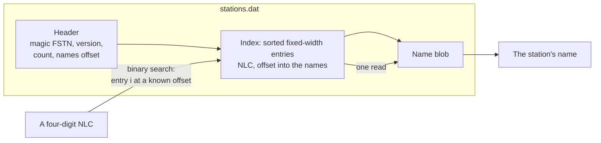
```mermaid
flowchart LR
    subgraph file["stations.dat"]
        header["Header<br/>magic FSTN, version,<br/>count, names offset"]
        idx["Index: sorted fixed-width entries<br/>NLC, offset into the names"]
        names["Name blob"]
        header --> idx --> names
    end
    query["A four-digit NLC"] -->|"binary search:<br/>entry i at a known offset"| idx
    idx -->|"one read"| names
    names --> result["The station's name"]
```

The station table is packaged rather than compiled in because a `const` array
reaches RAM: the 79 KB table would cost 79 KB of heap. The stop table is kept
out of the package entirely because everything packaged is re-uploaded on each
install: 20 MB over the Flipper's USB serial port takes upwards of ten minutes,
and an interrupted upload leaves a `.fap` the loader will not open.

## Memory

The Flipper has about 190 KB of heap, and the whole `.fap` image is loaded
into it before `main()` runs. Memory is the constraint every structural
decision is checked against.

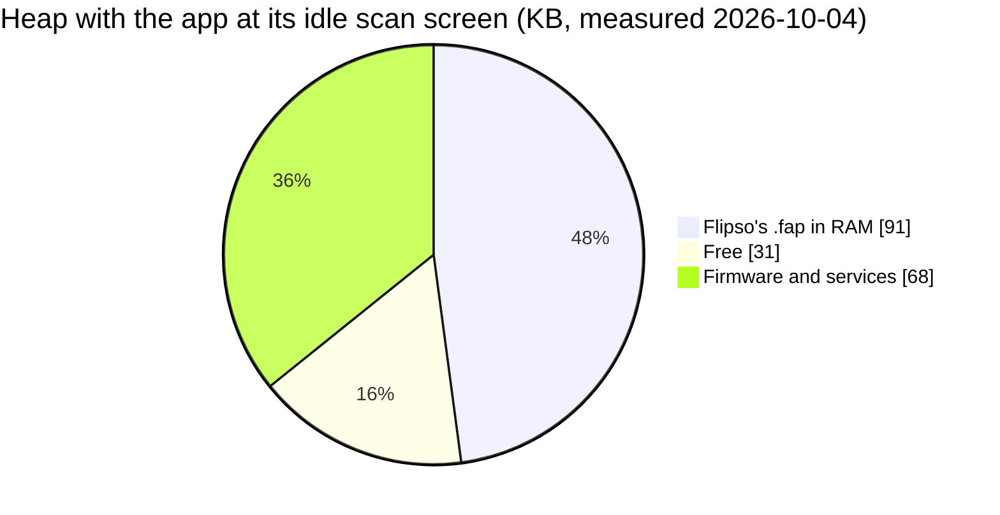
```mermaid
pie showData title Heap with the app at its idle scan screen (KB, measured 2026-10-04)
    "Flipso's .fap in RAM" : 91
    "Free" : 31
    "Firmware and services" : 68
```

The firmware's share is approximate: it moves by up to 15 KB between boots.

What the design does about it:

| Decision | Saving |
| --- | --- |
| Station table and demo cards in `.fapassets`, not `const` arrays | About 105 KB of RAM never mapped |
| Products, value records and taps allocated to fit, not to a fixed cap | About 15 KB with a card on screen, against arrays sized for 20 products and 12 taps |
| `ItsoTerms` a union of three families, with value records and locations moved out of the product | 672 to 268 bytes a product |
| Locations kept as bytes and rendered when drawn | Part of what took a tap from 204 bytes to 128 |
| Capping and reservations decoded on demand, freed before the text is shown | About 750 bytes for the longest demo, only while it is built |
| Paper-ticket and non-ITSO DESFire structures allocated only for those cards | Nothing on any other card |
| CMD2 and Type 2 transport buffers allocated on first use | Nothing on a DESFire read |
| Capture arena grown to fit | A DESFire card uses about a tenth of the ceiling |

`tools/flipper/flipctl size` reports which sections reach RAM, and
`flipctl mem` measures the heap before and after a change. `CLAUDE.md` records
the current figures and how to compare them fairly.

## Testing

The device loop - build, install, hold a card against the Flipper - takes a
minute and needs a person. The host loop takes about a second, so it is where
bugs are found; the device is for confirming a fix.

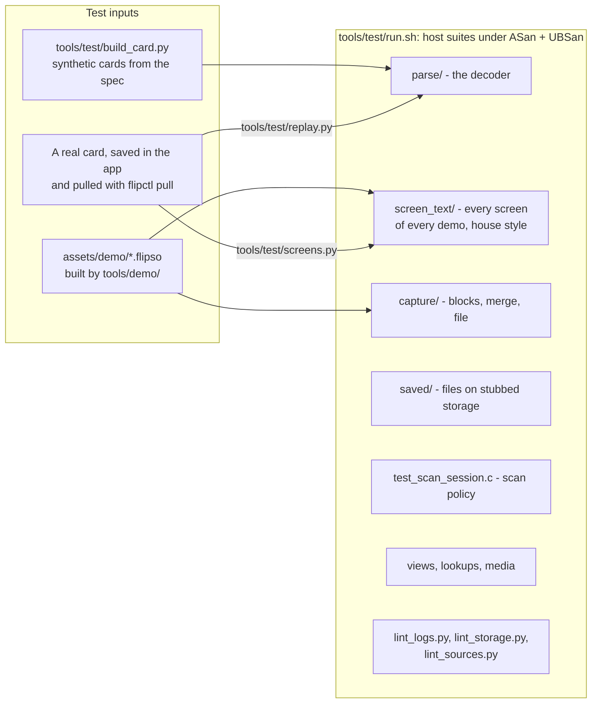
```mermaid
flowchart LR
    subgraph inputs["Test inputs"]
        synth["tools/test/build_card.py<br/>synthetic cards from the spec"]
        demo["assets/demo/*.flipso<br/>built by tools/demo/"]
        real["A real card, saved in the app<br/>and pulled with flipctl pull"]
    end
    subgraph suites["tools/test/run.sh: host suites under ASan + UBSan"]
        parse["parse/ - the decoder"]
        screen["screen_text/ - every screen<br/>of every demo, house style"]
        cap["capture/ - blocks, merge, file"]
        sav["saved/ - files on stubbed storage"]
        sess["test_scan_session.c - scan policy"]
        misc["views, lookups, media"]
        lints["lint_logs.py, lint_storage.py,<br/>lint_sources.py"]
    end
    synth --> parse
    demo --> screen
    demo --> cap
    real -->|"tools/test/replay.py"| parse
    real -->|"tools/test/screens.py"| screen
```

`tools/test/stub/` stands in for the few firmware interfaces the pure-C layers
touch (furi strings, the locale, storage). Test buffers are exactly as long as
the data claims to be, so an over-read lands outside the allocation where the
sanitiser sees it.

## Design decisions

The decisions that shape the code, and what each was for.

**Save the bytes, not the decode.** A saved card is the raw blocks a read
produced, and loading one runs today's decoder over them. The alternative -
serialising `ItsoCard` - would freeze each card at the decoder that saved it,
need a serialiser for every new field, and lose the ability to replay a real
card through the host tests. Keeping bytes makes a decoder fix reach every
saved card, and makes every saved card a test case.

**The decoder knows nothing of the firmware.** `itso/` and
`cards/flipso_capture*.c` include no firmware headers, so they build on a laptop
under sanitisers. This is what makes the fast loop possible, and it is held as
a rule rather than a preference.

**Policy apart from mechanism.** The scan policy (`flipso_scan_session.c`), the
page order (`flipso_product_pages.c`), the merge (`flipso_capture_merge.c`) and
the screen text (`format/`) are each kept apart from the firmware code that
acts on them, so each can be tested through every path without hardware.

**One responsibility to a file, one table per variation.** A new medium is a
transport file; a new IPE type is a row in `itso_ipe_types[]` and a file; a new
screen is a `flipso_format_<screen>.c`. Variation lives in tables
(`itso_ipe_types[]`, the slot-to-page map, the icon table) rather than in
switches spread across the tree.

**Allocate to fit.** Nothing is sized for the worst case and left mostly
empty: products, value records, taps, the capture arena, a paper ticket's
extra data and the transport buffers are each allocated for what the card
holds. Structures used by one screen are decoded on demand and freed.

**Keep data in its cheapest form until it is shown.** Locations stay as bytes,
capping and reservations stay in the capture, and station and stop names stay on
the SD card, each turned into text only when a screen draws it.

**A saved card remembers more than the card.** Merging on save, matching
records byte for byte, turns repeated reads into a longer history than the
card can hold. Products the card has dropped are kept as whole groups so a
lapsed season ticket still shows, marked as off the card.

**Never lose the user's file.** A save writes aside and renames into place, and
every launch finishes or undoes an interrupted one. A storage handle is closed
even when its open failed, because the firmware keeps a failed path registered
and the next launch's open of it would block for ever (`lint_storage.py`
checks the shape).

**One scan, however many reads.** The user presses OK once. Detection,
transport switching and retries all happen with the card still on the reader,
and the verdict is only "not an ITSO card" when the card was read cleanly.

**Tell the user only what is true.** A read that lost part of the card is
retried rather than shown half-read; a blocked or retired card gets the error
tone even though it read perfectly; "Not an ITSO card" is never said of a card
that kept dropping out.

**One text scene, one house style.** Every detail screen is paged text from
`format/`, `Label: Value` with a capitalised value, money as `£`, details
indented and labelled, the first page answering whether the ticket is good and
Technical always last. The tests enforce it, so the screens read as one app.

**Generated, not hand-edited.** Icons come from `tools/icons/build_icons.py`,
the demo cards from `tools/demo/`, the station and stop tables from their
builders, and the IDE's index from `tools/ide/compdb.py`. The generators are
the source; `run.sh` fails when the demo cards are stale.

**No development logging in a release.** `FURI_LOG_D` and `FURI_LOG_T` are
banned from the app sources (`lint_logs.py`): the Apps Catalog rejects an app
that ships them, and a debug line about card bytes would put a card number in
the log. The one `FURI_LOG_I` that matters is `UI ready`, which `flipctl` waits
for to know a launch reached the screen.
